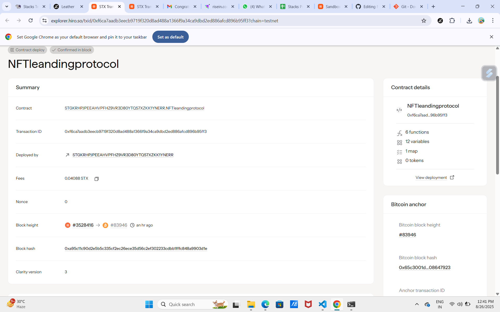

# NFT Lending Protocol

## Project Description

The NFT Lending Protocol is a decentralized collateralized lending platform built on the Stacks blockchain using Clarity smart contracts. This protocol enables NFT holders to unlock the liquidity of their digital assets by using them as collateral to borrow STX tokens. The platform provides a secure, transparent, and efficient way for users to access immediate liquidity without having to sell their valuable NFTs.

Key features include:
- **Collateralized Lending**: Use NFTs as collateral to borrow STX tokens
- **Loan-to-Value Ratio**: Borrow up to 70% of the NFT's assessed value
- **Secure Asset Management**: Smart contract holds NFT collateral safely during loan period
- **Flexible Repayment**: Borrowers can repay loans and retrieve their NFTs at any time
- **Transparent Operations**: All loan data and transactions are recorded on-chain

## Project Vision

Our vision is to create a comprehensive DeFi ecosystem that bridges the gap between NFT ownership and liquid capital. We aim to:

- **Democratize Access to Liquidity**: Enable NFT holders to access immediate funds without sacrificing ownership of their digital assets
- **Foster NFT Market Growth**: By providing liquidity solutions, we encourage more participation in the NFT ecosystem
- **Build Trust Through Transparency**: Utilize blockchain technology to ensure all transactions are verifiable and secure
- **Create Sustainable Lending**: Establish a self-sustaining protocol that benefits both borrowers and the broader DeFi community
- **Promote Financial Inclusion**: Provide alternative financing options for creators, collectors, and investors in the digital asset space

## Future Scope

The NFT Lending Protocol has significant potential for expansion and enhancement:

### Short-term Enhancements (3-6 months)
- **Multi-NFT Collateral**: Support for bundling multiple NFTs as collateral for larger loans
- **Dynamic Interest Rates**: Implement variable interest rates based on market conditions and loan duration
- **Liquidation Mechanism**: Automatic liquidation system for defaulted loans to protect lenders
- **Oracle Integration**: Real-time NFT valuation using external price oracles

### Medium-term Development (6-12 months)
- **Peer-to-Peer Lending**: Direct lending between users without pooled funds
- **Cross-Chain Support**: Extend protocol to support NFTs from other blockchains
- **Governance Token**: Launch protocol governance token for community decision-making
- **Insurance Module**: Optional loan insurance for both borrowers and lenders

### Long-term Vision (1-2 years)
- **Institutional Features**: Advanced tools and higher limits for institutional users
- **Derivatives Market**: NFT-backed financial derivatives and structured products
- **Mobile Application**: User-friendly mobile interface for broader accessibility
- **AI-Powered Valuation**: Machine learning algorithms for automated NFT price assessment
- **Social Features**: Community ratings, borrower profiles, and reputation systems

### Potential Integrations
- **DeFi Protocols**: Integration with yield farming and liquidity mining protocols
- **NFT Marketplaces**: Direct integration with major NFT trading platforms
- **Wallet Providers**: Native support in popular Stacks wallets
- **Analytics Platforms**: Partnership with NFT analytics and tracking services

## Contract Address Details

**Smart Contract Information:**
- **Network**: Stacks Mainnet/Testnet
- **Contract Address**: [To be added after deployment]
- **Contract Name**: nft-lending-protocol
- **Deployment Block**: [To be added after deployment]
- **Deployment Transaction**: [To be added after deployment]

**Contract Functions:**
- `create-loan`: Create a new loan using NFT as collateral
- `repay-loan`: Repay existing loan and retrieve NFT collateral
- `get-loan`: Query loan information by loan ID
- `get-total-loans-issued`: Get total amount of loans currently active
- `calculate-max-loan`: Calculate maximum borrowable amount for given NFT value

**Contract Constants:**
- **Loan-to-Value Ratio**: 70% (borrowers can borrow up to 70% of NFT value)
- **Supported Collateral**: All NFT contracts (configurable)
- **Base Currency**: STX tokens

---

## Contract Address: 

STGKRHPJPEEAHVPFHZ9VR3D80YTQ57XZKK1YNERR.NFTleandingprotocol

